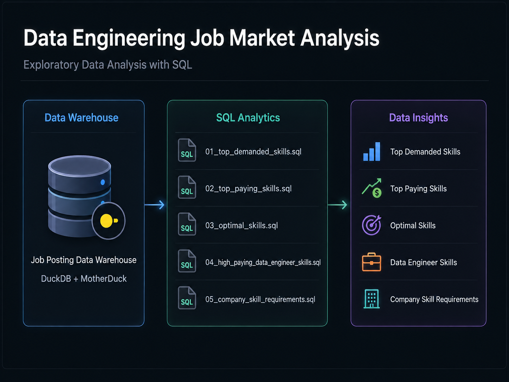
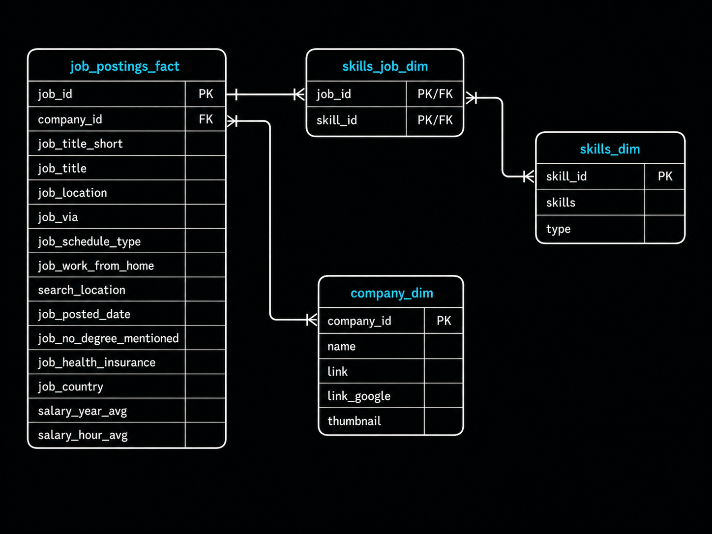

# Exploratory Data Analysis w/ SQL: Job Market Analysis
 
## Executive Summary

This project explores job-posting data using **SQL (Structured Query Language)** to analyze skill demand, salaries, Data Engineer opportunities, and company skill requirements.

The goal is to turn raw job-market data into useful insights and demonstrate practical SQL analysis techniques.

---

## Problem & Context

Job-posting data contains thousands of records across different companies, roles, locations, salaries, and required skills.

This project answers five practical questions about the job market using a relational data warehouse and SQL analysis.

---

## Tech Stack

- **SQL (Structured Query Language)** — Data querying and analysis
- **DuckDB** — Analytical database engine
- **MotherDuck** — Cloud-based DuckDB platform
- **Visual Studio Code (VS Code)** — SQL development
- **Bash Terminal** — File navigation and project workflow
- **Git & GitHub** — Version control and project sharing

---

## Data Warehouse

The project uses four connected tables:

- `job_postings_fact`
- `company_dim`
- `skills_job_dim`
- `skills_dim`

These tables connect job postings with companies and required skills.

- **Fact Table:** `job_postings_fact`  
  Central table containing job posting details such as job titles, locations, salaries, and dates.

- **Dimension Tables:**
  - `company_dim` — Company information linked to job postings
  - `skills_dim` — Skills catalog containing skill names and types

- **Bridge Table:** `skills_job_dim`  
  Connects job postings and skills and resolves the many-to-many relationship between them.

By querying across these connected tables, I was able to analyze skill demand, salary patterns, company requirements, and optimal skill combinations for data engineering roles.

---

## Analysis Overview

### 01. Top In-Demand Skills
[01_top_demanded_skills.sql](../1_EDA/01_top_demanded_skills.sql)
Identifies the skills that appear most frequently in job postings.

### 02. Top Paying Skills
[02_top_paying_skills.sql](../1_EDA/02_top_paying_skills.sql) Finds the skills associated with the highest average yearly salaries.

### 03. Optimal Skills
[03_optimal_skills.sql](../1_EDA/03_optimal_skills.sql)
 Finds skills that provide the strongest combination of **salary and demand** using a calculated optimal skill score.

### 04. High-Paying Data Engineer Skills
[04_high_paying_data_engineer_skills.sql](../1_EDA/04_high_paying_data_engineer_skills.sql)
 Finds Data Engineer jobs paying over **$100,000** and connects each job with its company, location, salary, and required skills.

### 05. Company Skill Requirements
[05_company_salary_statistics.sql](../1_EDA/05_company_salary_statistics.sql)
 Finds companies with the largest number of different skills across their job postings.

---

## SQL Skills Demonstrated

### Complex Joins
- `INNER JOIN`
- `LEFT JOIN`
- Multiple-table joins
- Many-to-many relationships
- **PK (Primary Key)** and **FK (Foreign Key)** relationships

### Aggregations
- `COUNT()`
- `COUNT(DISTINCT ...)`
- `AVG()`
- Aggregate calculations across grouped data

### Filtering
- `WHERE`
- `HAVING`
- Multiple conditions
- Salary filters
- Job-title filters
- `IS NOT NULL`

### Grouping
- `GROUP BY`
- Grouping by skills
- Grouping by companies
- Grouping using multiple columns

### Sorting & Limiting
- `ORDER BY`
- `ASC`
- `DESC`
- `LIMIT`

### Conditional Logic
- `CASE`
- `AND`
- `OR`
- Parentheses for controlling query logic

### Mathematical Functions
- `ROUND()`
- Salary calculations
- Demand and salary normalization

### Calculated Metrics
Created calculated values to make the analysis more meaningful, including an **Optimal Skill Score** that combines:

- Skill demand
- Average salary

This helps identify skills that are valuable based on both market demand and earning potential.

### Data Analysis Techniques
- Ranking results
- Comparing salary and demand
- Identifying unique skills
- Removing duplicate values with `DISTINCT`
- Filtering grouped results with `HAVING`
- Handling missing salary data
- Creating readable aliases
- Turning raw data into useful job-market insights
