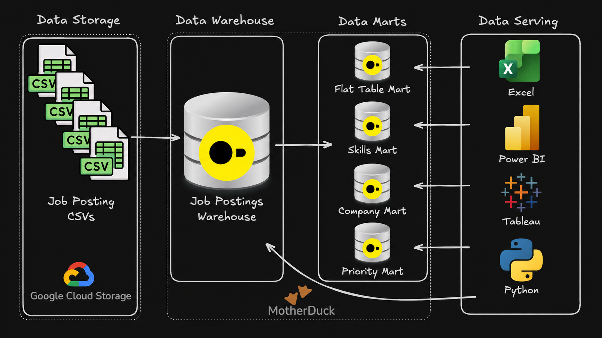
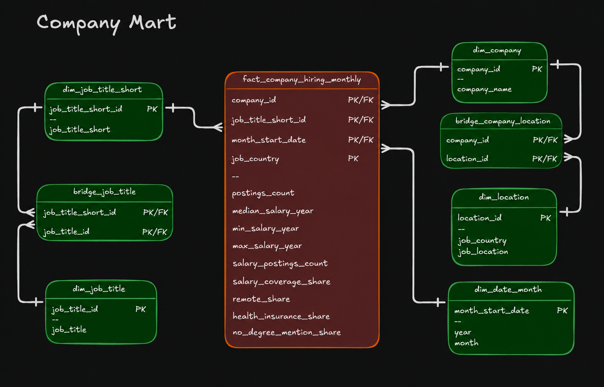

# 🏗️ Data Warehouse & Mart Build: End-to-End ETL Pipeline

An end-to-end data engineering pipeline that transforms raw job-posting CSV files from Google Cloud Storage into a structured DuckDB data warehouse and builds specialized analytical data marts.



---

## 🧾 Project Highlights

* ✅ **End-to-End Pipeline:** Built a complete ETL workflow from cloud-hosted CSV files to a structured data warehouse and analytical marts
* ✅ **Data Modeling:** Designed fact, dimension, and bridge tables to organize job, company, skill, and hiring data
* ✅ **Mart Development:** Built Flat, Skills, Priority, and Company marts for different analytical use cases
* ✅ **Incremental Processing:** Implemented SQL `MERGE` logic for insert, update, and delete synchronization
* ✅ **Business Metrics:** Created salary coverage, remote-work, health-insurance, and no-degree share metrics
* ✅ **Pipeline Orchestration:** Organized the workflow into modular SQL scripts executed through a master build file

---

## 🧩 Problem & Context

Raw job-posting data is stored as CSV files in Google Cloud Storage and is not structured for efficient analytical querying.

The data needs to support questions such as:

* Which skills are most in demand over time?
* Which companies are hiring the most?
* How does hiring activity change by month?
* How do salary patterns vary by company and job category?
* What percentage of postings contain salary information?
* How common are remote work, health insurance, and no-degree requirements?

**Challenge:** The raw job-posting data is spread across multiple CSV files and is not structured for efficient analytical queries. Querying the source files directly would require repeated joins, transformations, filtering, date calculations, and aggregations. It would also make it harder to maintain consistent business logic across different analyses.

**Solution:** Build a structured DuckDB data warehouse as the central analytical layer, then transform the warehouse data into specialized marts for skill demand, priority-job tracking, company hiring trends, and simplified ad-hoc analysis. This reduces repeated query logic and provides reusable datasets for downstream reporting and analysis.

---

## 🧰 Tech Stack

* 🐤 **Database:** DuckDB — file-based analytical database for warehouse and mart development
* 🧮 **Language:** SQL — schema design, data loading, transformations, aggregations, and validation
* ☁️ **Storage:** Google Cloud Storage — source CSV files
* 📊 **Data Modeling:** Fact, dimension, bridge tables, and analytical data marts
* 🛠️ **Development:** VS Code + Git Bash / Terminal
* 💻 **Execution:** DuckDB CLI for running SQL scripts and pipeline builds
* ⚙️ **Automation:** `build_dw_marts.sql` master script for automated pipeline execution
* 📦 **Version Control:** Git & GitHub — branching, commits, and project version control


---

## 📂 Repository Structure

```text
2_DW_Mart_Build/
├── 01_create_tables_dw.sql        # Create warehouse tables
├── 02_load_schema_dw.sql          # Load CSV data from GCS
├── 03_create_flat_mart.sql        # Build denormalized flat mart
├── 04_create_skills_mart.sql      # Build skills demand mart
├── 05_create_priority_mart.sql    # Build priority mart
├── 06_update_priority_mart.sql    # Incremental mart update
├── 07_create_company_mart.sql     # Build company hiring mart
├── build_dw_marts.sql             # Master pipeline script
└── README.md                      # Project documentation
```

---

## 🏗️ Pipeline Architecture


The pipeline ingests raw job-posting CSV data from Google Cloud Storage into a structured DuckDB data warehouse, where source data is normalized into fact, dimension, and bridge tables. The warehouse then serves as the transformation layer for four purpose-built analytical marts: Flat Mart, Skills Mart, Priority Mart, and Company Mart, each designed at a defined grain to support specific analytical and reporting workloads.


### Data Warehouse

The warehouse contains `company_dim`, `skills_dim`, `job_postings_fact`, and `skills_job_dim`.


* **SQL Files:**

  * [`01_create_tables_dw.sql`](./01_create_tables_dw.sql) — creates the warehouse tables
  * [`02_load_schema_dw.sql`](./02_load_schema_dw.sql) — loads source CSV data
* **Purpose:** Provide a structured source of truth for downstream transformations
* **Fact Grain:** One row per job posting
* **Key Feature:** `skills_job_dim` handles the many-to-many relationship between job postings and skills

### Flat Mart

The Flat Mart provides a denormalized structure for easier ad-hoc analysis.


* **SQL File:** [`03_create_flat_mart.sql`](./03_create_flat_mart.sql)
* **Purpose:** Reduce repeated joins across job, company, and skill data
* **Grain:** One row per job posting
* **Key Feature:** Stores skill information using an array of structs
* **SQL Techniques:** `LEFT JOIN`, `ARRAY_AGG`, `STRUCT_PACK`, `GROUP BY`

### Skills Mart

The Skills Mart supports monthly skill-demand analysis across job categories.


* **SQL File:** [`04_create_skills_mart.sql`](./04_create_skills_mart.sql)
* **Purpose:** Analyze how skill demand changes across time and job roles
* **Grain:** `skill_id + month_start_date + job_title_short`
* **Dimensions:** Skill and monthly date dimensions
* **Measures:** Posting count, remote posting count, no-degree posting count, and health-insurance posting count
* **Key SQL:** `DATE_TRUNC`, `EXTRACT`, `COUNT`, `CASE WHEN`, conditional aggregation

### Priority Mart

The Priority Mart tracks selected job categories and demonstrates incremental data processing.


* **SQL Files:**

  * [`05_create_priority_mart.sql`](./05_create_priority_mart.sql) — creates the initial Priority Mart
  * [`06_update_priority_mart.sql`](./06_update_priority_mart.sql) — applies incremental updates
* **Purpose:** Maintain priority job records without rebuilding the complete target table
* **Grain:** One row per job posting in the priority dataset
* **Key Feature:** Uses SQL `MERGE` for source-to-target synchronization
* **Operations:** Insert new records, update changed records, and delete records no longer present in the source

### Company Mart

The Company Mart analyzes monthly hiring activity by company, job category, and country.



* **SQL File:** [`07_create_company_mart.sql`](./07_create_company_mart.sql)
* **Purpose:** Analyze company hiring volume, salary patterns, and posting characteristics
* **Fact Table:** `fact_company_hiring_monthly`
* **Grain:** `company_id + job_title_short_id + month_start_date + job_country`
* **Key Feature:** Combines dimensional modeling with aggregated hiring, salary, and percentage metrics

**Measures:**

```text
postings_count
median_salary_year
min_salary_year
max_salary_year
salary_postings_count
salary_coverage_share
remote_share
health_insurance_share
no_degree_mention_share
```

`salary_coverage_share` measures the percentage of postings containing annual salary information, while the other share metrics summarize remote work, health insurance, and degree-related characteristics.

---

## 🔄 Pipeline Execution

The complete workflow is orchestrated through:

[`build_dw_marts.sql`](./build_dw_marts.sql)

Run from the `2_DW_Mart_Build` directory:

```bash
duckdb dw_marts.duckdb -c ".read build_dw_marts.sql"
```

Execution order:

```text
01 → Create Data Warehouse
02 → Load Warehouse Data
03 → Build Flat Mart
04 → Build Skills Mart
05 → Build Priority Mart
06 → Update Priority Mart
07 → Build Company Mart
```

---

## 💻 Data Engineering Skills Demonstrated

### ETL Pipeline Development

* **Extract:** Load CSV files from Google Cloud Storage into DuckDB
* **Transform:** Normalize data, convert types, create date attributes, aggregate records, and calculate analytical metrics
* **Load:** Populate warehouse and mart tables using SQL
* **Incremental Updates:** Use `MERGE` to synchronize Priority Mart records
* **Orchestration:** Execute the complete workflow through `build_dw_marts.sql`

### Dimensional Modeling

* **Fact & Dimension Design:** Build warehouse and mart tables around clearly defined analytical grains
* **Bridge Tables:** Handle many-to-many relationships between jobs, skills, companies, locations, and job titles
* **Grain Definition:** Define the level of detail before creating aggregated fact tables
* **Additive Measures:** Use count-based measures that can be safely aggregated
* **Derived Metrics:** Calculate salary coverage and percentage-based hiring measures

### Advanced SQL Techniques

* **DDL:** `CREATE TABLE`, `DROP TABLE`, `CREATE SCHEMA`
* **DML:** `INSERT INTO ... SELECT`
* **Joins & CTEs:** Multi-table transformations and reusable query steps
* **Date Functions:** `DATE_TRUNC`, `EXTRACT`
* **Conditional Logic:** `CASE WHEN`
* **Aggregations:** `COUNT`, `MIN`, `MAX`, `MEDIAN`
* **Composite Types:** `ARRAY_AGG`, `STRUCT_PACK`, `UNNEST`
* **Incremental Updates:** `MERGE INTO`

### Data Quality & Engineering Practices

* **Data Validation:** Execute validation queries to verify table creation, row counts, fact-table grain, aggregate measures, and percentage-based metrics
* **Idempotent Design:** Build rerunnable SQL workflows using patterns such as `CREATE OR REPLACE`, `IF EXISTS`, and deterministic transformations to avoid duplicate or inconsistent results
* **Type Enforcement:** Define explicit SQL data types across warehouse and mart schemas to maintain consistency during ingestion and transformation
* **Schema Separation:** Isolate analytical domains into dedicated `flat_mart`, `skills_mart`, `priority_mart`, and `company_mart` schemas
* **Repeatable Execution:** Use a centralized build script to execute pipeline stages in a controlled and consistent sequence
* **Execution Control:** Use ordered dependencies and validation checkpoints to detect failures before downstream transformations are executed
* **Version Control:** Manage SQL development, branching, and change history using Git and GitHub

